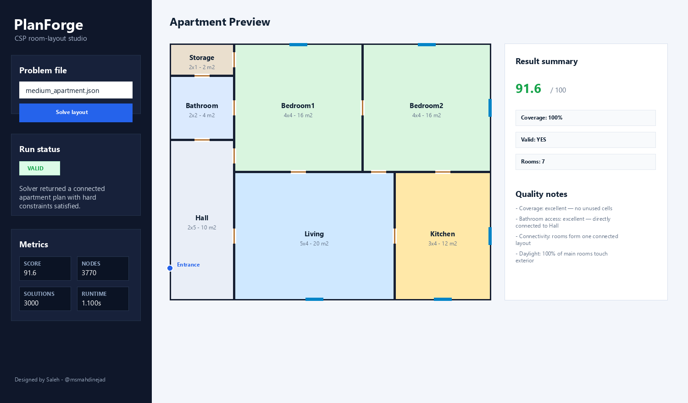
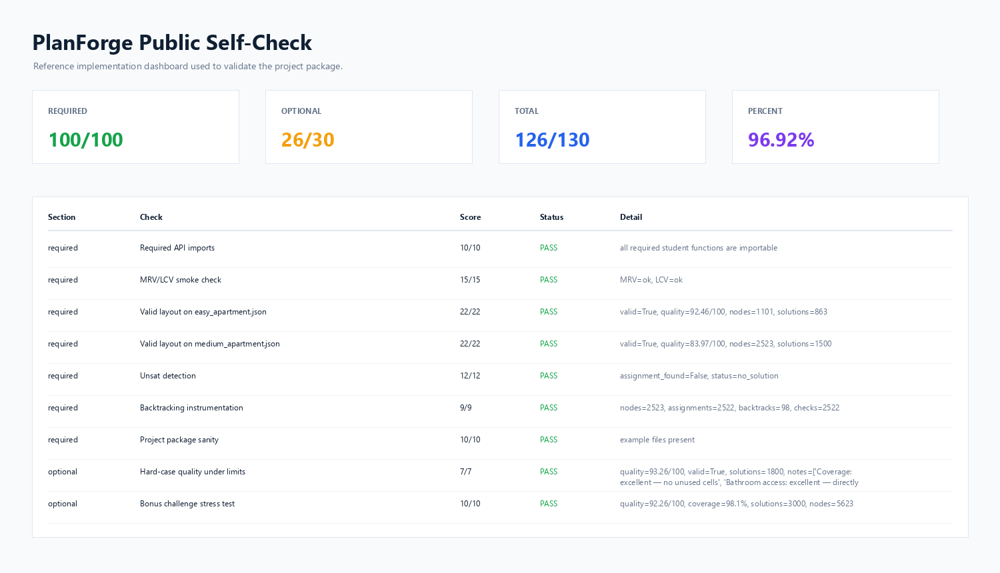

# PlanForge

**PlanForge** is a constraint satisfaction problem (CSP) project for generating apartment floor plans from declarative room and adjacency constraints. It was designed for the Artificial Intelligence Fundamentals and Applications course as a hands-on assignment in backtracking search, consistency checking, variable/value ordering, inference, and soft optimization.



## Project Idea

Students are given a fixed apartment shell, a set of rooms, and a JSON problem definition containing hard constraints such as adjacency, boundary access, entrance distance, room area limits, and layout connectivity. Their task is to complete the solver inside `student/` so the framework can place all rooms on a grid and return a valid architectural layout.

The framework already provides:

- JSON problem loading and domain generation
- room geometry primitives
- hard-constraint validation
- architectural quality scoring
- a Tkinter desktop visualizer
- public self-check tooling
- visible easy, medium, hard, unsatisfiable, and bonus challenge cases

Students implement:

- recursive backtracking search
- complete-assignment detection
- consistency checks for partial assignments
- MRV variable selection
- LCV value ordering
- optional forward checking and AC-3
- optional soft scoring for better layouts

## Screenshots

### Visual Layout Studio

The desktop app lets students select a JSON case, run their solver, inspect metrics, and view the generated apartment plan.


### Public Self-Check Dashboard

The public self-check provides visible feedback for required and optional behavior. It is not the final grader.



## Repository Structure

```text
PlanForge/
├── assets/
│   └── screenshots/
├── docs/
│   ├── INSTRUCTOR_OVERVIEW.md
│   └── PlanForge_Project_Guide_FA.pdf
├── planforge/
│   ├── core/
│   ├── examples/
│   └── grader/
├── student/
├── run_app.py
├── run_public_grade.py
├── run_windows.bat
├── requirements.txt
└── README.md
```

## Quick Start

PlanForge has no required external Python package dependencies. Python 3.10+ is recommended.

```bash
git clone https://github.com/msmahdinejad/PlanForge.git
cd PlanForge
python run_app.py
```

On Windows, students can also double-click:

```text
run_windows.bat
```

## Running the Public Self-Check

```bash
python run_public_grade.py
```

The public grader is designed for feedback only. Official grading should use private hidden tests outside this repository.

## Student Work Area

Only the files in `student/` are intended to be edited by students:

```text
student/
├── solver.py
├── consistency.py
├── heuristics.py
├── inference.py
├── scoring.py
└── README_STUDENT_FILES.md
```

Changing framework files under `planforge/`, examples, or grader files should not be required for a valid submission.

## CSP Model

Each apartment problem is defined as a JSON file under `planforge/examples/`. A case specifies:

- grid width and height
- entrance location
- required rooms
- minimum and maximum room areas
- allowed room dimensions
- exterior-access requirements
- hard constraints such as `adjacent`, `not_adjacent`, `near_entrance`, `far_from_entrance`, `touches_boundary`, and `touches_wall`
- minimum coverage ratio
- connectivity requirements

The framework converts every room specification into a finite domain of valid rectangles. The student solver then searches over room-to-rectangle assignments.

## Grading Design

The assignment has a 100-point required section and a 30-point optional section.

Required work covers:

- API importability
- recursive backtracking
- hard-constraint consistency
- MRV and LCV behavior
- valid layouts for visible public cases
- unsatisfiable-case detection
- solver instrumentation through `SolverContext`

Optional work rewards:

- forward checking
- AC-3 preprocessing
- stronger pruning
- high-quality layouts under finite search limits
- meaningful soft scoring

See [Instructor Overview](docs/INSTRUCTOR_OVERVIEW.md) for release and grading notes.

## Official Project Guide

The full Persian project guide is available here:

[PlanForge Project Guide FA](docs/PlanForge_Project_Guide_FA.pdf)

## Author

Designed by [Mohammad Saleh Mahdinejad](https://github.com/msmahdinejad/).
