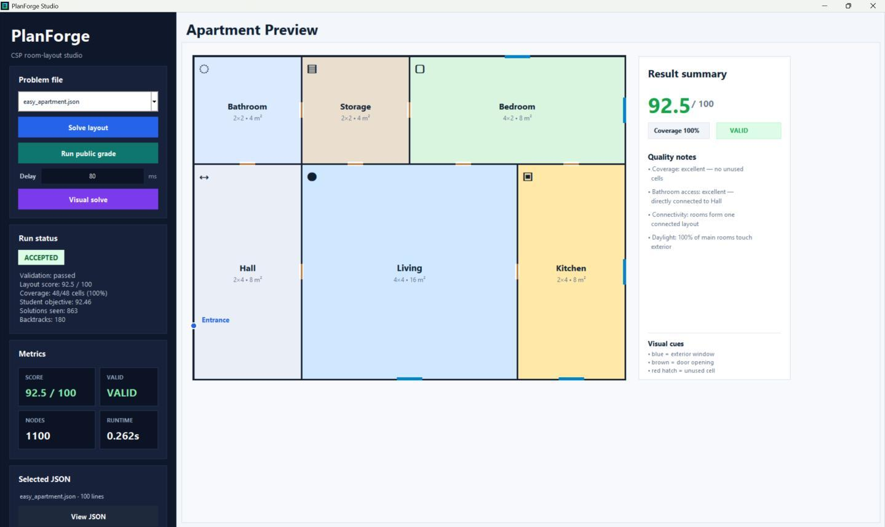
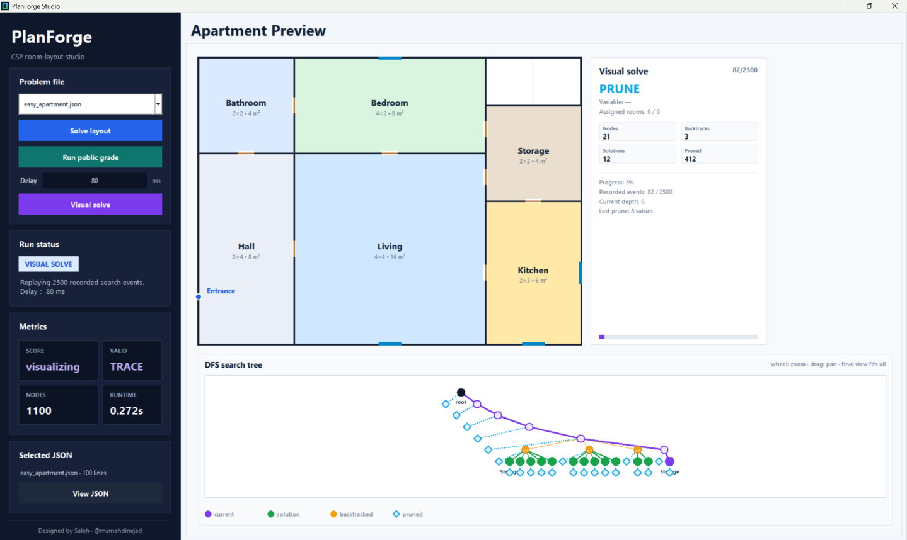
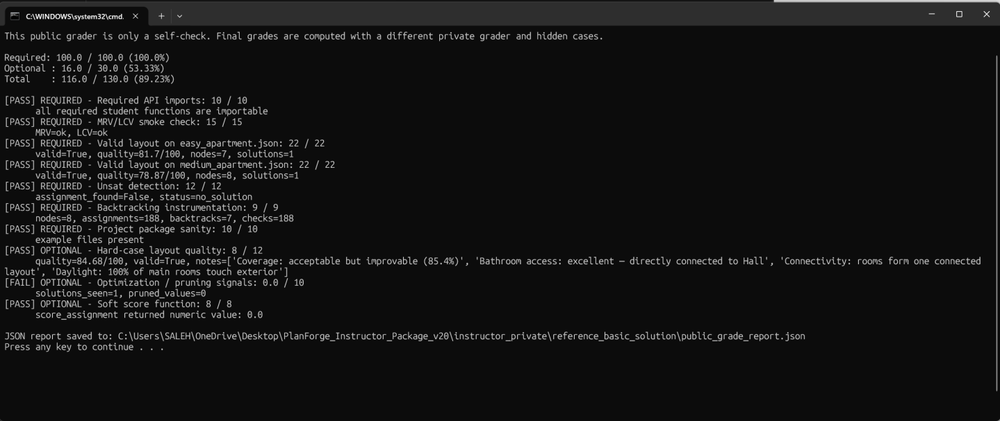

# PlanForge

**PlanForge** is a constraint satisfaction problem (CSP) framework for generating apartment floor plans from declarative architectural constraints. It was designed as an Artificial Intelligence Fundamentals and Applications assignment focused on recursive backtracking, consistency checking, MRV, LCV, inference, soft scoring, and search visualization.

The project is intentionally split into two parts:

- a polished framework that loads JSON apartment cases, builds finite domains, validates layouts, scores architectural quality, and visualizes the result;
- a student-owned `student/` package where the solver logic must be implemented.



## What Students Build

Students receive a fixed apartment shell, a list of rooms, and a set of hard constraints. Their solver must assign one rectangle to each room so that the final apartment plan is valid.

The framework provides:

- JSON problem loading
- finite rectangle-domain generation
- geometry helpers
- hard-constraint validation
- architectural quality scoring
- a desktop visualizer
- a Visual solve trace mode
- public self-check tooling
- visible easy, medium, hard, unsatisfiable, and bonus challenge cases

Students implement:

- recursive backtracking search
- complete-assignment detection
- partial consistency checking
- MRV variable selection
- LCV value ordering
- optional forward checking
- optional AC-3 preprocessing
- optional soft scoring for better floor plans

## Visual Overview

### CSP Workflow

The assignment turns a JSON floor-plan description into a finite-domain CSP, runs the student solver, validates the result, and renders the final layout.

```text
JSON problem -> finite rectangle domains -> student solver -> validator -> visualizer
```

### Layout Studio

The desktop studio lets students select a problem file, run the solver, inspect runtime metrics, and view the generated apartment plan. Rooms are drawn as colored rectangles, exterior windows are highlighted in blue, door openings are shown in brown, and unused grid cells are marked.


### Visual Solve and DFS Tree

The **Visual solve** mode is the most important teaching feature. It runs the real student solver with tracing enabled, then replays the recorded search. The apartment canvas updates as assignments are made and removed, while the lower panel displays the DFS/backtracking tree.

This mode helps students see:

- which variable was selected next;
- which room rectangle was tried;
- where the algorithm backtracked;
- how pruning changes the search tree;
- where valid solutions were discovered;
- how MRV, LCV, forward checking, and AC-3 affect search behavior.



### Public Self-Check

The public self-check gives visible feedback for required and optional behavior. It is useful for debugging, but it is not the final grader.



## Technical Report

A full English LaTeX technical report is included:

- [PlanForge Technical Report PDF](docs/PlanForge_Technical_Report.pdf)
- [PlanForge Technical Report LaTeX source](docs/PlanForge_Technical_Report.tex)

The report explains the CSP formulation, JSON schema, framework architecture, solver instrumentation, Visual solve mode, quality scoring, public/private grading split, and recommended student implementation path.

## Repository Structure

```text
PlanForge/
|-- assets/
|   `-- screenshots/
|-- docs/
|   |-- INSTRUCTOR_OVERVIEW.md
|   |-- PlanForge_Technical_Report.pdf
|   `-- PlanForge_Technical_Report.tex
|-- planforge/
|   |-- core/
|   |-- examples/
|   `-- grader/
|-- student/
|-- run_app.py
|-- run_public_grade.py
|-- run_windows.bat
|-- requirements.txt
`-- README.md
```

## Quick Start

PlanForge has no required external Python package dependencies. Python 3.10+ is recommended.

```bash
git clone https://github.com/msmahdinejad/PlanForge.git
cd PlanForge
python run_app.py
```

On Windows, students can also double-click:

```text
run_windows.bat
```

## Running the Public Self-Check

```bash
python run_public_grade.py
```

The public grader is a self-check only. Official grading should use private hidden cases outside this repository.

## Student Work Area

Only these files are intended to be edited by students:

```text
student/
|-- solver.py
|-- consistency.py
|-- heuristics.py
|-- inference.py
|-- scoring.py
`-- README_STUDENT_FILES.md
```

Changing framework files under `planforge/`, examples, or grader files should not be required for a valid submission.

## CSP Model

Each apartment problem is defined as a JSON file under `planforge/examples/`. A case specifies:

- grid width and height;
- entrance location;
- required rooms;
- minimum and maximum room areas;
- allowed room dimensions;
- exterior-access requirements;
- hard constraints such as `adjacent`, `not_adjacent`, `near_entrance`, `far_from_entrance`, `touches_boundary`, and `touches_wall`;
- minimum coverage ratio;
- connectivity requirements.

The framework converts every room specification into a finite domain of valid rectangles. The student solver then searches over room-to-rectangle assignments.

## Grading Design

The assignment has a 100-point required section and a 30-point optional section.

Required work covers:

- API importability;
- recursive backtracking;
- hard-constraint consistency;
- MRV and LCV behavior;
- valid layouts for visible public cases;
- unsatisfiable-case detection;
- solver instrumentation through `SolverContext`.

Optional work rewards:

- forward checking;
- AC-3 preprocessing;
- stronger pruning;
- high-quality layouts under finite search limits;
- meaningful soft scoring.

## Private Material Policy

This repository intentionally excludes instructor-only material:

- private grader source;
- hidden tests;
- reference solution source code;
- batch grading results;
- private grade reports.

The public repository is for assignment release and demonstration. Final grading should remain private.

## Author

Designed by [Mohammad Saleh Mahdinejad](https://github.com/msmahdinejad/).
